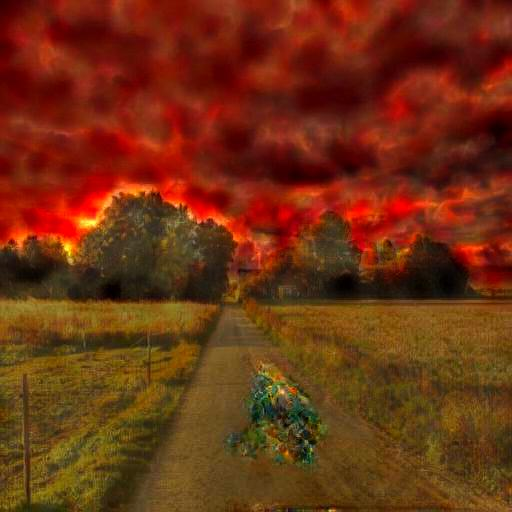
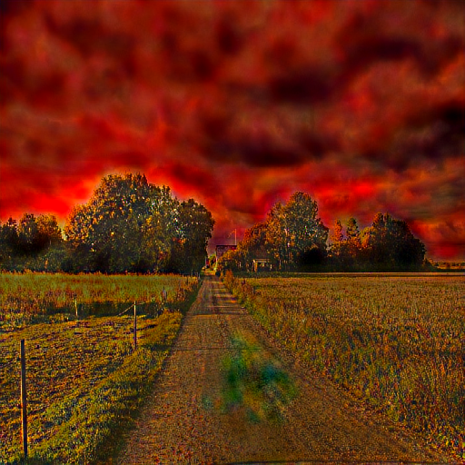

<!-- PROJECT LOGO -->
<br />
<p align="center">
  <h3 align="center">PhotoWCT</h3>

  <p align="center">
  “基于'A Closed-form Solution to Photorealistic Image Stylization'论文的非官方实现”
    <br />
  </p>
</p>

[In English](README_EN.md)

## 简要引述
本项目是“基于'A Closed-form Solution to Photorealistic Image Stylization'论文的非官方实现”，该项目是从 https://github.com/eridgd/WCT-TF 项目中fork而来。 <br/>

官方实现位于 https://github.com/NVIDIA/FastPhotoStyle ，本项目遵循其中的 TUTORIAL.md 中 Example 3的步骤。 <br/>

论文链接：https://arxiv.org/abs/1802.06474  <br/>


## 探索步骤
### 数据准备
* 1 从 http://cocodataset.org/ 下载COCO数据集（这里使用的是coco2017版本）
  从网上下载 vgg_normalized.t7（通过download_vgg.sh可以下载）<br/>

* 2 如果不需要在输入中使用分割作为先验（可能需要在小波池化 wavelet pooling 设置中花费更多时间，可以在 WCTModel 构建中设     
  置 use_wavelet_pooling = True），则此步骤可能不是必需的。 <br/>

  使用项目 https://github.com/CSAILVision/semantic-segmentation-pytorch 生成一些分割结果。对于COCO数据集，如果您对使用权重存在疑惑，请参考我的issue评论 https://github.com/CSAILVision/semantic-segmentation-pytorch/issues/116 <br/

  然后您可以编辑 test.py 中的 dataloader 以生成自己的分割结果，并将它们保存在 "path/to/val2017".replace("2017", "2017_seg") 或 "path/to/train2017".replace("2017", "2017_seg") 中。<br/>

* 3 使用 merge_pics_segs/merge.py 将图像和分割结果合并，并将它们保存在 "path/to/val2017".replace("2017", "2017_with_label") 或 "path/to/train2017".replace("2017", "2017_with_label") 中。<br/>


### 训练和检测推断过程

合并的生成结果可以在 path/to/simple2017/style_with_label.png 或 path/to/simple2017/content_with_label.png 中进行查看 <br>

* 4 模型训练部分: <br><br>
    ```bash
    python train_edit.py --relu-target relu3_1 --content-path path/to/train2017_with_label --batch-size 8 --feature-weight 1 --pixel-weight 1 --tv-weight 0.0 --learning-rate 1e-4 --max-iter 50000 --val-path path/to/val2017_with_label --checkpoint path/to/ckpt/
    ```

* 5 推断部分:<br><br>
   ```bash
   python stylize.py --input-checkpoint C:\Coding\Python\PhotoWCT\ckpt\model.ckpt-4601 --relu-targets relu3_1 --alpha 0.8 --style-path path/to/simple2017/style_with_label.png --content-path path/to/simple2017/content_with_label.png --out-path C:\Coding\Python\WCT_tf_final\output --passes 1
   ```

* 6 结果去噪, 在线链接位于 http://tools.pfchai.com <br/> 或者使用下面的脚本 https://github.com/pfchai/Haze-Removal/blob/master/HazeRemovalWidthGuided.py
<br>


<table>
<tr>
<td></td>
<td></td>
</tr>
</table>

<!-- CONTACT -->
## Contact

<!--
Your Name - [@your_twitter](https://twitter.com/your_username) - email@example.com
-->
svjack - svjackbt@gmail.com - ehangzhou@outlook.com

<!--
Project Link: [https://github.com/your_username/repo_name](https://github.com/your_username/repo_name)
-->
Project Link:[https://github.com/svjack/PhotoWCT](https://github.com/svjack/PhotoWCT)
